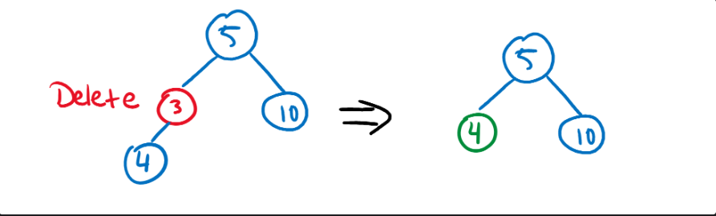
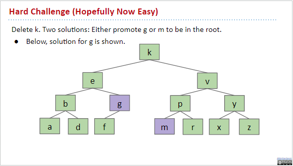
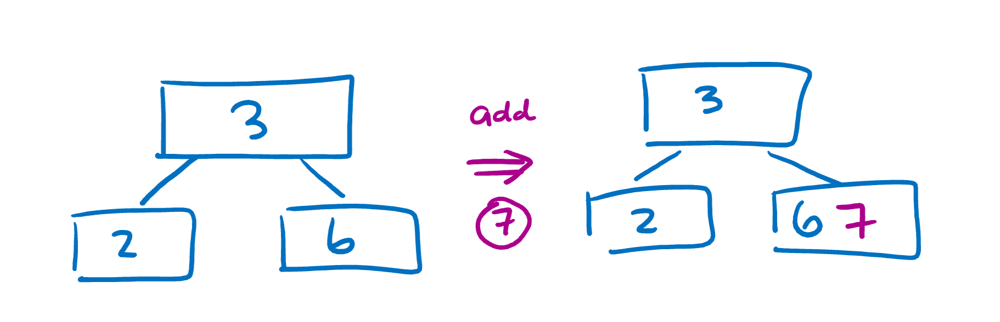
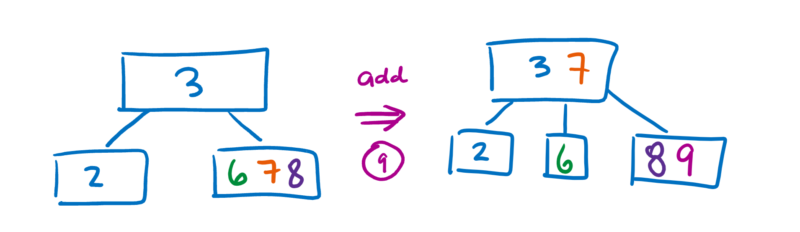
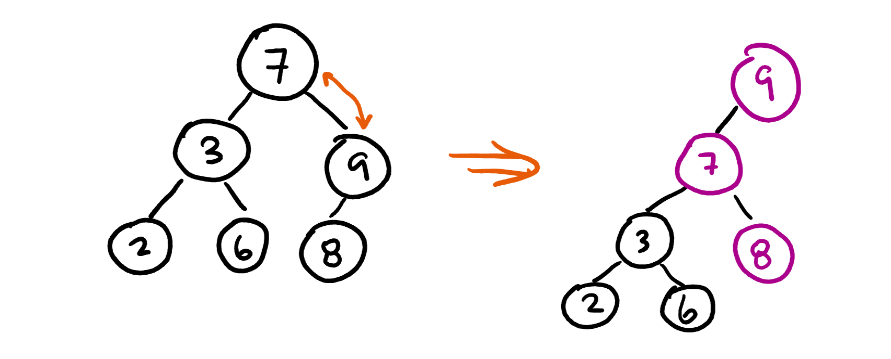
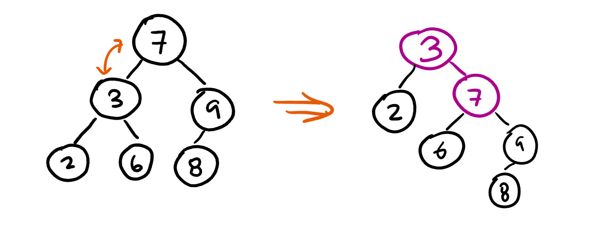

# Trees and Traversals

## Rooted Trees

- A tree consists of a set of nodes and a set of edges that connect pairs of nodes
- A tree has the property that there is exactly one path (no more, no less) between any two nodes of the tree
- A **path** is a sequence of one or more nodes, each consecutive pair being connected by an edge
- In a **rooted** tree, one distinguished node is called the **root**. Every node c, except the root, has exactly one **parent** node p, which is the first node after c on the path from c to the root.
- The root has no parent. A node can have any number of children

### Other definitions

- A **leaf** is a node with no children
- An **internal node** is a non-leaf node (having one or more children)
- **Siblings** are nodes with the same parent
- The **ancestors** of a node d are the nodes on the path from d to the root
- if a is an ancestor of d, then d is a **descendant** of a
- The **length** of a path is the number of edges of a path
- The **depth** of a node n is the length of the path from n to the root (The depth of the root is zero)
- The **height** of a node n  is the length of the path from n to its deepest descendant
- The **subtree** rooted at node n is the tree formed by n and its descendants
- A **binary tree** is a tree in which no node has more than two children, and every child is either a **left child** or a **right child**, even if it's the only child its parent has
- A sorted binary tree is a **binary search tree**
	- Every value in the left subtree of a node is less than the node's values
	- Every value in the right subtree of a node is greater than the node's value
	- Values are transitive - there are no duplicate values
	- The tree is complete - it is possible to compare any two values in the tree and say that one is either less than or greater than the other
	- The tree is antisymmetric - if p <q is true and q < r is also true, then it must follow that p < r

### Tree Operations

#### Find

Finding a value in a tree uses the Binary Search algorithm
- If searchKey equals T.key, return.
- If searchKey ≺ T.key, search T.left.
- If searchKey ≻ T.key, search T.right.

```java
static BST find(BST T, Key sk) {

   if (T == null)

      return null;

   if (sk.equals(T.key))

      return T;

   else if (sk ≺ T.key)

      return find(T.left, sk);

   else

      return find(T.right, sk);

}
```

#### Insert

The insert algorithm is very similar to binary search
- Search for the item. If it’s found, then do nothing since the value is already in the tree.
- If it’s not found (search would return null in this case), then create a node and put it where it should be found. If using recursion, this last step is already done- all we need to do is return a new node!

```java
public BST insert(BST T, Key sk) {
    if (T == null) {
        // Create new leaf with given key. Different from search
        return new BST(sk, null, null); 
    }
    if (sk.equals(T.key)) {
        return T;
    } else if (sk < T.key) {
        T.left = find(T.left, sk); // Different from search
    } else {
        T.right = find(T.right, sk); // Different from search
    }
}
```

#### Delete
Needs to preserve the binary search tree structure, might need to shuffle around nodes after deletion

1. The node to delete is a leaf. Just remove that node and you're done
2. The node to delete has one child. Swap the node with its child then delete the node
	
3. The node to delete has two children. Traverse the node's children to find the next biggest value and swap that up to replace the old node.
	

### Asymptotic Analysis

- A binary tree can be bushy or spindly. Very different performances
- Bushy trees are the best, parents have two children
	- Height of $\theta$(log(n))
- Spindly trees are the worst case, parents have exactly 1 child, basically a linked list
	- Height of $\theta$(n)
### Limits of Trees

While trees are extremely versatile and fantastic for a variety of applications, trees have some limitations that make it difficult to use in some situations
- All items in a tree need to be comparable
- Must be hierarchical
- Hash tables and tries have better time complexity

## Balanced Search Structures

Always bushy

### B Trees (2-4 Trees)

- Nodes can hold multiples values
- Each parent can have 2-4 children
- Limit on the number of items allowed in a single node to guarantee that search will always be $\theta$(n) 
- Nodes may contain between 1 and L (limit) items
- Perfect balance
#### Adding values to a B-Tree

If a node already 2 or more children, place a new value in one of the existing children:



If a node is full, split the node by moving one value up to the parent and creating another child node:



##### Properties of B Trees

- Searching in a single node is constant runtime
- All leaves must be same distance from the root
- A non-leaf node with k items must have k+1 children
- The height of a B Tree is guaranteed to be $\theta$(log(n)) because it is bushy

### Red-Black Trees and Tree Rotation

- BST that is structurally identical to a 2-3 Tree
- Black nodes are normal binary tree nodes
- Red nodes represent the nodes in B Trees with more than one value
- Left leaning red black trees only have red nodes on the left

- Tree rotations swap around nodes so that adding new nodes won't break the Red Black Tree structure
- Two types: left and right rotation
	- Left rotation: left node moves the right node up and left to replace the parent
		
	- Right rotation: right node moves the left node up and right to replace the parent
		
#### Insertion
- Always add values to a leaf node as a red node first
- If the link is leaning right, rotate the tree to make it left leaning
- If a node already has a red link to the left, temporarily add it to the right also as a red link
	- Then, flip the color of all links connected to the node (if previously black, turn red; if previously red, turn black)
	- Might need to fix right-leaning red nodes that are created as a result
- If a node has red links to both parent and child, rotate it such that it becomes the above case, and then handle that case like you did before
#### Properties of Red Black Trees
- Red Black trees have a one-to-one correspondence with B trees. That means for every Red Black tree, there is exactly one B tree that represents the same connections. Same runtimes as well!
- Every node must have the same number of black nodes in between itself and the root
## Heaps

### What are Heaps

Similar to binary trees, but have differences
- Heaps **only care about the root node**. Root node is either the smallest or largest value in the heap
- Every element in the heap must be **larger than all its children** (in a max heap) or **smaller than all its children** (in a min-heap). This is known as the **heap property**
**A node's parent has an index equal to half of that node's index.**

### The Heapify Algorithm

The most important heap algorithm is heapify, which converts any non-heap list into a heap. This algorithm is vital to most heap functions like insert or remove, since these functions often break the heap structure. 

1. Start with the element in the middle of the array(the root)
	.png)
2. If the root is smaller than either of its children (larger for a min-heap), swap it with its largest child (smallest for a max-heap)
	.png)
3. If the root was swapped, recursively call heapify on the new position. Otherwise stop recursion
	.png)

## Tries

### Main ideas

A trie is a specific implementation of a set and is short for retrieval tree

It only works on sets with a finite alphabet, like digits or ASCII characters for example. The idea is that each node can act like an array containing all characters in the alphabet and we can just access the branches super fast be indexing into them

Example:
.png)

Makes the add() and contains() functions run in $\theta$(1) time!

Can be condensed!
.png)