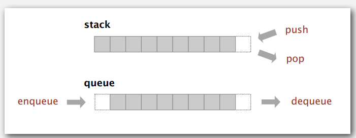

# Bags, Queues, and Stacks
#stacks #queues

## Stacks and queues

### Fundamental data types

- Value: collection of objects
- Operations insert, remove, iterate, test if empty
- Intent is clear when we insert
- Which item do we remove?



- **Stack**: Examine the item most recently added. LIFO
- **Queue**: Examine the item least recently added. FIFO
- **Deque**: Both stack and a queue. FIFO + LIFO

## Client, implementation, interface

### Separate Interface and implementation

Ex: stack, queue, bag, priority queue, symbol table, union-find

### Benefits
- Client can't know details of implementation ⇒ client has many implementation from which to choose.
- Implementation can't know details of client needs ⇒ many clients can re-use the same implementation.
- Design: creates modular, reusable libraries.
- Performance: use optimized implementation where it matters

## Stacks

Linked list implementation
```java
public class LinkedStackOfStrings { 
	private Node first = null;

	private class Node { 
		String item; 
		Node next; 
	} 
	public boolean isEmpty() { 
		return first == null; 
	} 
	public void push(String item) { 
		Node oldfirst = first; 
		first = new Node(); 
		first.item = item; 
		first.next = oldfirst; 
	} 
	public String pop() { 
		String item = first.item; 
		first = first.next; 
		return item; 
	} 
}
```

Array implementation
```java
public class FixedCapacityStackOfStrings { 
	private String[] s; 
	private int N = 0; 
	public FixedCapacityStackOfStrings(int capacity) { 
		s = new String[capacity]; 
	} 
	public boolean isEmpty() { 
		return N == 0; 
	} 
	public void push(String item) { 
		s[N++] = item; 
	} 
	public String pop() { 
		String item = s[--N];
		s[N] = null;
		return item;
	} 
}
```

## Resizing arrays

push() and pop() are too expensive as they need to copy all items to a new array and inserting first *N* items takes time proportional to  *N*<sup>2</sup> / 2.

To grow array, you could create a new array of twice the size and copy items

To shrink array, halve the size of array s[] when array is one-quarter full

#### Linked-list implementation
- Every operation takes constant time in the worst case
- Uses extra time and space to deal with the links

#### Resizing-array implementation
- Every operation takes constant amortized time
- Less wasted space

## Queues

Maintain pointer to first and last nodes in a linked list

insert/remove from opposite ends

```java
public class LinkedQueueOfStrings { 
	private Node first, last; 
	private class Node { 
		/* same as in StackOfStrings */ 
	} 
	public boolean isEmpty() {
		return first == null; 
	} 
	public void enqueue(String item) { 
		Node oldlast = last; 
		last = new Node(); 
		last.item = item; 
		last.next = null; 
		if (isEmpty()) first = last; 
		else oldlast.next = last; 
	} public 
	String dequeue() { 
		String item = first.item; 
		first = first.next; 
		if (isEmpty()) last = null; 
		return item; 
	} 
}
```

## Generics

```java
public class Stack<Item> { 
	private Node first = null;

	private class Node { 
		Item item; 
		Node next; 
	} 
	public boolean isEmpty() { 
		return first == null; 
	} 
	public void push(ITem item) { 
		Node oldfirst = first; 
		first = new Node(); 
		first.item = item; 
		first.next = oldfirst; 
	} 
	public Item pop() { 
		Item item = first.item; 
		first = first.next; 
		return item; 
	} 
}
```

Array implementation
```java
public class FixedCapacityStack<Item> { 
	private Item[] s; 
	private int N = 0; 
	public FixedCapacityStackOfStrings(int capacity) { 
		s = (Item[]) new Object[capacity]; 
	} 
	public boolean isEmpty() { 
		return N == 0; 
	} 
	public void push(Item item) { 
		s[N++] = item; 
	} 
	public Item pop() { 
		Item item = s[--N];
		s[N] = null;
		return item;
	} 
}
```

## Iterators

Used to retrieve elements one by one, can be used on any Collection object. Used to loop through collections. 

```java
public class Main {
  public static void main(String[] args) {

    // Make a collection
    ArrayList<String> cars = new ArrayList<String>();
    cars.add("Volvo");
    cars.add("BMW");
    cars.add("Ford");
    cars.add("Mazda");

    // Get the iterator
    Iterator<String> it = cars.iterator();

	while(it.hasNext()) {
      Integer i = it.next();
      if(i < 10) {
        it.remove();
      }
    }
    System.out.println(numbers);
  }
}
```