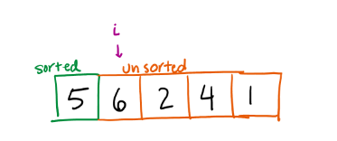
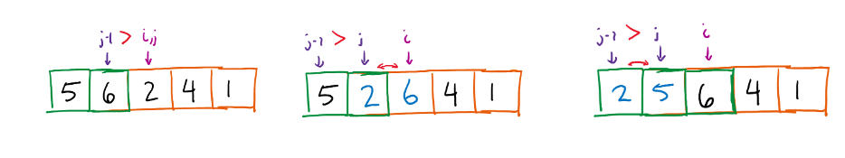
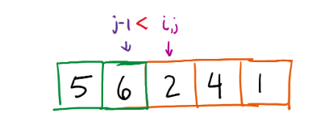

# Elementary Sorts
#sorting

## Selection Sorts

```java 
public class SelectionSort {  
    public double[] sort(double[] arr) {  
        // Boundary of unsorted array  
        for (int i = 0; i < arr.length - 1; i++) {  
            int smallestIndex = i;  
            // Looping through unsorted array  
            for (int j = i + 1; j < arr.length; j++) {  
                if (arr[smallestIndex] > arr[j]) {  
                    smallestIndex = j;  
                }  
            }  
            double tempValue = arr[i];  
            arr[i] = arr[smallestIndex];  
            arr[smallestIndex] = tempValue;  
        }  
        return arr;  
    }  
  
    public static void main(String[] args) {  
        SelectionSort example = new SelectionSort();  
        double[] nums = new double[7];  
        for (int i = 0; i < nums.length; i++) {  
            nums[i] = Math.random() * 100;  
        }  
        for (int i = 0; i < nums.length; i++) {  
            System.out.printf("%f ", nums[i]);  
        }  
        System.out.printf("\n");  
        example.sort(nums);  
        for (int i = 0; i < nums.length; i++) {  
            System.out.printf("%f ", nums[i]);  
        }  
    }  
}
```

## Insertion Sort

```java
public class InsertionSort {  
    public static int[] sort(int[] arr) {  
        for (int i = 0; i < arr.length; i++) {  
            for (int j = i; j > 0; j--) {  
                if (arr[j] < arr[j-1]) {  
                    int temp = arr[j-1];  
                    arr[j-1] = arr[j];  
                    arr[j] = temp;  
                }  
            }  
        }  
        return arr;  
    }  
    public static void main(String[] args) {  
        int[] nums = {1 ,3, 2, 7, 5, 6, 10, 9};  
        for (int num : nums) {  
            System.out.print(num + " ");  
        }  
        System.out.println();  
        sort(nums);  
        for (int num:nums) {  
            System.out.print(num + " ");  
        }  
    }  
}
```

1. Start assuming the leftmost number is "sorted" and all other numbers are unsorted
	
1. Skip the first number, going through all numbers from left to right (i)
	- Numbers left of (i) are all sorted and all numbers right of (i) are unsorted
	- Starting with number (i), go left into the sorted region (j)
		- If (j) is less than the directly preceding number, it's not sorted! So swap and set(j) to the previous index
			
		- Otherwise, do nothing because (j) is already in the correct position
			
## Shell Sort
```java
public class ShellSort {  
    public static int[] sort(int[] arr) {  
        int h = 1;  
        while (h < arr.length / 3)  
            h = 3 * h + 1;  
        while (h >= 1) {  
            for (int i = h; i < arr.length; i++) {  
                for (int j = i; j >= h && arr[j] < arr[j - h]; j -= h) {  
                    int temp = arr[j - h];  
                    arr[j - h] = arr[j];  
                    arr[j] = temp;  
                }  
            }  
            h = h / 3;  
        }  
        return arr;  
    }
}
```

## Shuffling

```java
public class StdRandom {
	public static void shuffle(Object[] a) { 
		int N = a.length; 
		for (int i = 0; i < N; i++) { 
			int r = StdRandom.uniform(i + 1); 
			exch(a, i, r); } 
		} 
	}
}
```

## Convex hull

The convex hull of a set of *N* points is the smallest perimeter fence enclosing the points
- Smallest convex set containing all the points
- Smallest area convex polygon enclosing the points
- Convex polygon enclosing the points, whose vertices are points in set

Convex hull output: sequence of vertices in counterclockwise order

Mechanical algorithm: hammer nails perpendicular to plane: stretch rubber bands around points

Robot motion planning: find shortest path in the plane from *s* to *t* that avoids a polygonal obstacle

